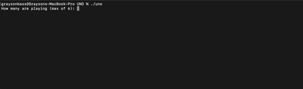

The project was to implement a terminal based game that implements the base rules and card types from the UNO game. 
It implemets the following:
  - Creating player's hands 
  - Shuffling and managing the deck
  - Managing the players hands
  - Handling each turn
  - Rendering the cards to the terminal.

  
